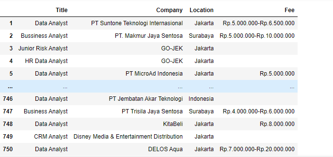
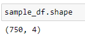
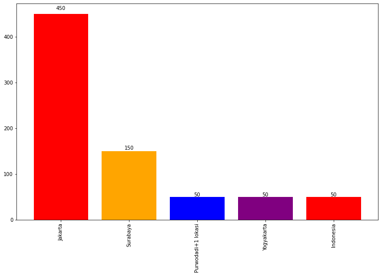
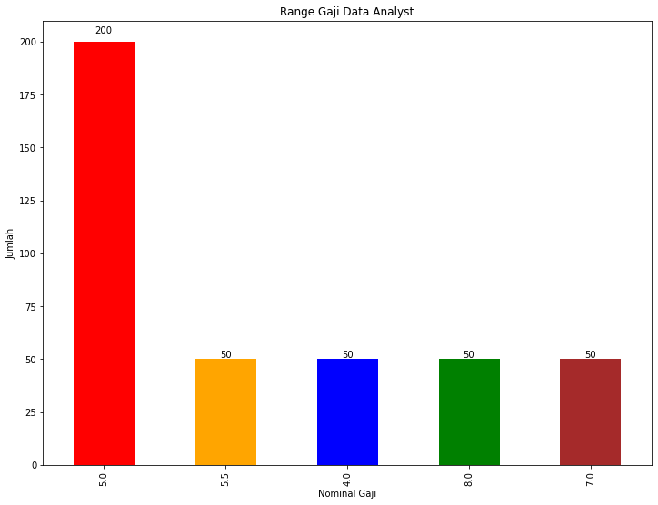
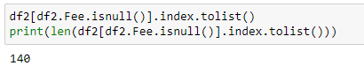
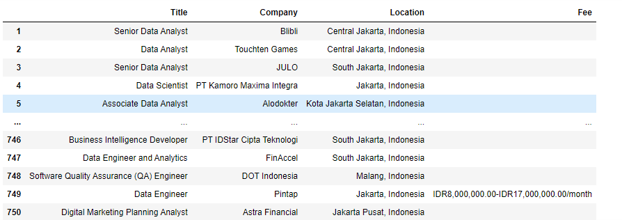
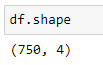
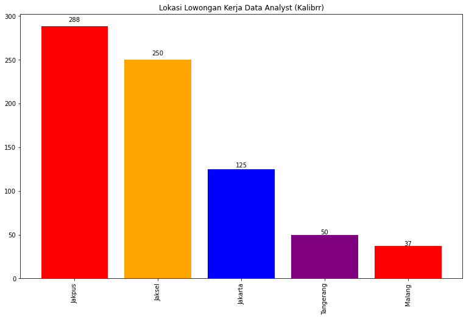
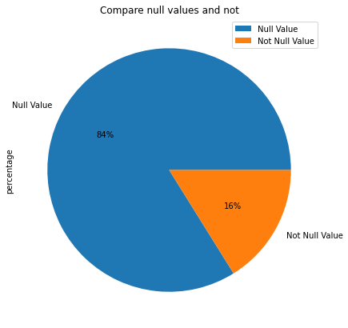

# Analyzing_Indeed

# What is Indeed?

<a href="https://id.indeed.com/">Indeed</a> is a job vacancy site visited by 250 million people every month (source: https://id.indeed.com/about). Not only in Indonesia, Indeed is an international company that provides job information in various regions on an international scale.

# This Project
In this project I collected data for Job of Data Analyst in Indonesia. I used this data to answer the following questions.

<ul>1. Where is the most location that open data analyst job vacancy?</ul>
<ul>2. What is the salary range for data analyst jobs offered?</ul>

This process code can be checked in a file with ipynb format

# My Findings

## 1. Data Frame from result of Web Scraping Process
</img>

This result I got after scraping process in 50 pages in this link 
<a href="https://id.indeed.com/jobs?q=data%20analyst&l=indonesia&from=searchOnHP&vjk=284ce6d382cca087">https://id.indeed.com/</a> 
The Data Frame consist of 750 rows and 4 columns ("Title","Company","Location","Fee)
 
</img>

## 2. Comparison of locations with data analyst job openings
</img>
 The most location that open data analyst job vacancy is <b>Jakarta</b>

## 3. The salary range for data analyst job
</img>
 The salary offered starts from the range of 4 million.
 This figure is taken from the lowest range offered.
 Some job vacancies do not include a salary range.
 Data obtained after going through the cleaning process. Of the 750 data, there are 140 data fees that are empty, so it is enough to drop them.

 </img>

# Analyzing_Kalibr

# What is Kalibrr?
<a href="https://www.kalibrr.com/">Kalibrr</a> is a company that provides a platform for worker recruitment. This is motivated by the fact that companies often experience being overwhelmed during the process of recruiting prospective employees.

# This Project
The web scraping method that I did for the kalibrr website is not much different from the indeed website. But I want to compare the results of web scraping taken from 2 different sources. I used this data to answer the following questions.

<ul>1. Where is the most location that open data analyst job vacancy?</ul>
<ul>2. What is the salary range for data analyst jobs offered?</ul>

# My Findings

## 1. Data Frame from result of Web Scraping Process
</img>

This result I got after scraping process in 50 pages in this link 
<a href="https://www.kalibrr.com/job-board/te/data%20analyst/1">https://www.kalibrr.com/</a> 
The Data Frame consist of 750 rows and 4 columns ("Title","Company","Location","Fee)
 
</img>

## 2. Comparison of locations with data analyst job openings
It is known that there are several naming locations that have the same meaning. For example, South Jakarta is written as South Jakarta, Indonesia and the City of South Jakarta, Indonesia. So that previously the data was regrouped by location in order to get more accurate results.

After grouping, the location results are obtained according to the following.

</img>
 The most location that open data analyst job vacancy is <b>Jakarta</b>, Central Jakarta to be exact.
This result is same with the data taken from the indeed website.

## 3. The salary range for data analyst job
Unfortunately, the salary data from this website has many null values. From 750 data, the null values is 629. 
Here is a comparison of empty and not fee data
 </img>

All coding above, can check in the ipynb format

