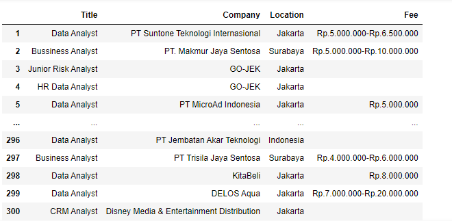
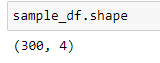

# Analyzing_Kalibr

# What is Kalibrr?

<a href="https://www.kalibrr.com/">Kalibrr</a> is a company that provides a platform for worker recruitment. This is motivated by the fact that companies often experience being overwhelmed during the process of recruiting prospective employees.

# This Project
In this project I collected data for Job of Data Analyst in Indonesia. I used this data to answer the following questions.

<ul>1. Where is the most location that open data analyst job vacancy?</ul>
<ul>2. What is the salary range for data analyst jobs offered?</ul>

# My Findings

## 1. Data Frame from result of Web Scraping Process
</img>

This result I got after scraping process in 20 pages in this link 
<a href="https://id.indeed.com/jobs?q=data%20analyst&l=indonesia&from=searchOnHP&vjk=284ce6d382cca087">https://id.indeed.com/</a> 
The Data Frame consist of 300 rows and 4 columns ("Title","Company","Location","Fee)
 
</img>

## 2. Comparison of locations with data analyst job openings
</img>
 The most location that open data analyst job vacancy is <b>Jakarta</b>

## 3. The salary range for data analyst job
</img>
 The salary offered starts from the range of 4 million.
 This figure is taken from the lowest range offered.
 Some job vacancies do not include a salary range.

